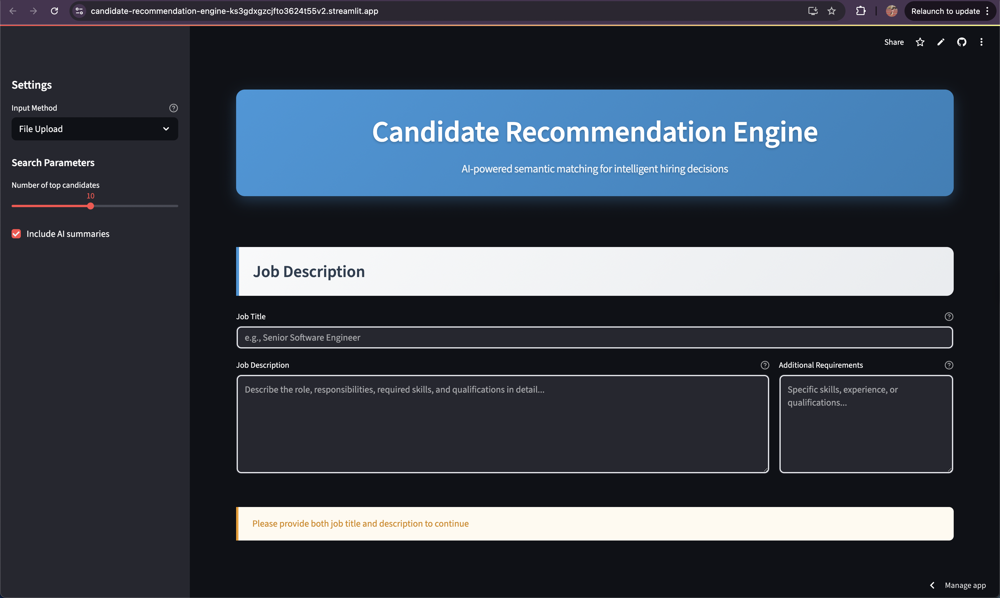

# Candidate Recommendation Engine

An AI-powered web application that matches the best candidates to job descriptions using semantic similarity and machine learning.

## **Try It Now - Live Demo**

**Access the app instantly:** https://candidate-recommendation-engine-ks3gdxgzcjfto3624t55v2.streamlit.app/

**Login / Credentials:** Not required — the public demo is open.

### Approach (at a glance)
Parse → Embed → L2-normalize → Cosine similarity → Rank top-K → (Optional) AI summary

### Screenshots

<p align="center">
  
  <br>
  <em>Figure 1: Home — Job Description input and resume uploader.</em>
</p>


- 
- 
- - 
- 
- 

### **How to Use:**

1. **Smart AI Selection:**

   - **Automatic Mode**: App automatically uses the best available AI service
   - **No Setup Needed (Deployed)**: The public app uses **server-side secrets (Streamlit Cloud)**; users don’t need to enter any keys
   - **Local Runs (Optional)**: Use your own keys via `.streamlit/secrets.toml` or `.env`
   - **Intelligent Fallback**: Seamlessly switches between services for optimal performance

2. **Enter Job Details:**

   - Job title and detailed job description
   - Requirements and preferred skills
3. **Upload Resumes:**

   - Upload multiple PDF, DOCX, or TXT files
   - Or paste resume text directly

4. **Get Results:**
   - View ranked candidates with similarity scores
   - Read AI-generated fit summaries
   - Analyze charts and detailed breakdowns

**AI Service Tiers (Automatic based on the availability of the models):**

- **🚀 Premium**: OpenAI API (Best quality)
- **✨ Professional**: Cohere API (Excellent quality)
- **⚡ Enhanced**: Hugging Face API (Good quality)
- **📊 Basic**: TF-IDF Analysis (Always available)

---

> **NEW**: **Automatic Smart Selection** - Our app automatically uses the best available AI service, providing premium quality with intelligent fallback to ensure continuous operation.

## 🏠 **Run Locally**

Want to run the app on your own machine? It's easy!

### **Quick Start (One Command):**

```bash
./run_local.sh
```

### **Manual Setup:**

```bash
# 1. Activate virtual environment
source .venv/bin/activate

# 2. Install dependencies
pip install -r requirements.txt

# 3. Run the app
streamlit run streamlit_app.py
```

### **🔑 Local Benefits:**

- ✅ **Uses Your API Keys**: Automatically reads from `.env` file
- ✅ **Same Premium Experience**: Identical to cloud version
- ✅ **Fast Development**: Test changes instantly
- ✅ **Offline Capable**: Works without internet (TF-IDF mode)

**📱 App opens at:** `http://localhost:8501`

---

## Features

- **Automatic AI Service Selection**: Intelligent hierarchy - Premium → Professional → Enhanced → Basic
- **Smart Matching**: Uses AI embeddings and cosine similarity for semantic job-candidate matching
- **Multi-Tier AI Integration**: OpenAI, Cohere, Hugging Face APIs with intelligent fallback
- **Zero Setup Required**: Premium features work instantly with pre-configured API access
- **Multiple Input Methods**: Upload resume files (PDF/DOCX/TXT) or paste text directly
- **AI-Powered Insights**: Generated summaries explaining why each candidate is a great fit
- **Interactive UI**: Modern Streamlit interface with charts, metrics, and detailed candidate analysis
- **Production Ready**: Clean modular architecture with comprehensive error handling
- **Scalable Design**: Object-oriented components with separation of concerns

## Architecture

### Modular Cloud-First Architecture

```
┌─────────────────────────────────────────────────────────────────┐
│                    Streamlit Cloud App                         │
│                     (streamlit_app.py)                         │
└──────────────────────┬──────────────────────────────────────────┘
                       │
┌──────────────────────┴──────────────────────────────────────────┐
│                  Modular Components (src/)                     │
├─────────────────┬─────────────────┬─────────────────┬───────────┤
│    Models       │    Services     │      Utils      │    UI     │
│ ┌─────────────┐ │ ┌─────────────┐ │ ┌─────────────┐ │ ┌───────┐ │
│ │ Candidate   │ │ │ Embedding   │ │ │ Similarity  │ │ │Styles │ │
│ │JobDescription│ │ │ AI Service  │ │ │   Compute   │ │ │Display│ │
│ │SearchResult │ │ │ Document    │ │ │ Result      │ │ │Components││
│ └─────────────┘ │ │ Processor   │ │ │ Processor   │ │ └───────┘ │
└─────────────────┘ └─────────────┘ └─────────────────┘ └───────────┘
                       │
            ┌──────────┴──────────┐
            │   AI Service Tier   │
            │     (Automatic)     │
┌───────────┴───┬─────────────────┬─────────────────┬─────────────────┐
│   OpenAI      │     Cohere      │ Hugging Face    │     TF-IDF      │
│ (Premium)     │ (Professional)  │  (Enhanced)     │    (Basic)      │
│ text-embed-   │   Embed v3.0    │ BGE/E5/GTE     │ Enhanced Local  │
│ ada-002       │   Command R     │ Models         │ Processing      │
│ GPT-3.5/4     │                 │                │                 │
└───────────────┴─────────────────┴─────────────────┴─────────────────┘
```
## Assumptions & Limitations

- **Supported inputs:** PDF, DOCX, TXT resumes; JD via text input
- **File size:** Default limit ~10 MB per file (configurable)
- **Identity:** Candidate “Name/ID” is taken from filename (uploads) or the name field (text mode)
- **Language:** Optimized for English; other languages depend on the active embedding tier
- **Similarity scores:** True cosine similarity on L2-normalized vectors (0–1 → shown as 0–100%)
- **Privacy:** Files are processed in memory during a session; no server-side storage or logging of resume content
- **Cloud differences:** On Streamlit Cloud we avoid native deps like FAISS; we use NumPy (or Annoy, if enabled)

### Tech Stack

- **Frontend**: Streamlit with Plotly for interactive charts and modern UI
- **Architecture**: Modular OOP design with clean separation of concerns
- **ML/AI**:
  - **Premium**: OpenAI (text-embedding-ada-002 + GPT-3.5/4)
  - **Professional**: Cohere (Embed v3.0 + Command R)
  - **Enhanced**: Hugging Face Inference API (BGE/E5/GTE models)
  - **Basic**: Enhanced TF-IDF + SentenceTransformers (when available)
- **Vector Operations**: Cosine similarity with efficient batch processing
- **Document Processing**: PyPDF2, python-docx with robust text extraction
- **Deployment**: Streamlit Cloud with automatic GitHub integration
- **Configuration**: Environment-based secrets management (`st.secrets` + `.env`)

> **Note on FAISS:** FAISS benchmarks were run locally/off-cloud. The Streamlit Cloud deployment uses pure NumPy (or Annoy if enabled) for similarity to ensure compatibility. End-user experience and ranking quality are unchanged.

## Quick Start

### Prerequisites

- Python 3.11+
- Git (for cloning the repository)
- **Optional**: Your own API keys (app automatically uses premium services if none provided)

### 1. Clone & Setup

```bash
git clone https://github.com/yourusername/Candidate-Recommendation-Engine.git
cd Candidate-Recommendation-Engine
```

### 2. Environment Configuration

Create a `.env` file:

```bash
cp .env.example .env
```

Edit `.env` and add your API keys (optional - app works without them):

```env
OPENAI_API_KEY=your_openai_api_key_here    # Optional: For premium quality
COHERE_API_KEY=your_cohere_api_key_here    # Optional: For professional quality
HF_API_TOKEN=your_hf_token_here            # Optional: For enhanced quality

# Optional settings (with defaults)
DEBUG=True
API_HOST=0.0.0.0
API_PORT=8000
STREAMLIT_HOST=0.0.0.0
STREAMLIT_PORT=8501
```

> **Note**: Keys are optional for the **deployed** app (it uses server-side secrets in Streamlit Cloud).  
> For **local runs**, add your own keys via `.streamlit/secrets.toml` or `.env`.  
> Get keys at: 
>
> - OpenAI: [platform.openai.com/api-keys](https://platform.openai.com/api-keys)
> - Cohere: [dashboard.cohere.com/api-keys](https://dashboard.cohere.com/api-keys)
> - Hugging Face: [huggingface.co/settings/tokens](https://huggingface.co/settings/tokens)

## Automatic AI Service Hierarchy

Our app automatically selects the best available AI service in this priority order:

### **🚀 Tier 1: Premium (OpenAI)**

- **Technology**: OpenAI text-embedding-ada-002 + GPT-3.5/4
- **Quality**: Industry-leading semantic understanding
- **Use Case**: Professional HR, production environments
- **Features**: Premium embeddings + human-like summaries
- **Availability**: Automatic (no setup required)

### **✨ Tier 2: Professional (Cohere)**

- **Technology**: Cohere Embed v3.0 + Command R
- **Quality**: Excellent semantic understanding with multilingual support
- **Use Case**: Professional recruiting, international hiring
- **Features**: High-quality embeddings + enhanced analysis
- **Availability**: Automatic fallback

### **⚡ Tier 3: Enhanced (Hugging Face)**

- **Technology**: BGE/E5/GTE models via Inference API
- **Quality**: Good semantic understanding with fast processing
- **Use Case**: Medium-scale recruiting, budget-conscious teams
- **Features**: Quality embeddings + sophisticated analysis
- **Availability**: Automatic fallback

### **📊 Tier 4: Basic (TF-IDF + Local Models)**

- **Technology**: Enhanced TF-IDF + SentenceTransformers (when available)
- **Quality**: Reliable keyword and phrase matching
- **Use Case**: Testing, demos, offline environments
- **Features**: Advanced preprocessing + template analysis
- **Availability**: Always available (guaranteed fallback)

## Smart Selection Benefits

✅ **Zero Configuration**: Works immediately with premium quality  
✅ **Intelligent Fallback**: Seamlessly switches if one service is unavailable  
✅ **Cost Effective**: Uses our API allocations efficiently  
✅ **Consistent Experience**: Users always get the best available quality  
✅ **Production Ready**: Built-in redundancy for enterprise use

### 3. Run the Application

**Option A: One-Command Launch (Recommended)**

```bash
# Start the application with robust error handling
./run_local.sh
```

**🛑 Stop All Services**

```bash
./stop_local.sh
```

**Option B: Manual Setup**

```bash
# 1. Activate virtual environment
source .venv/bin/activate

# 2. Install dependencies
pip install -r requirements.txt

# 3. Run the application
streamlit run streamlit_app.py
```

**Option C: Custom Port**

```bash
# Run on specific port (e.g., 8502)
./run_local.sh 8502
```

## 📍 Access Points

- **Local App**: http://localhost:8501 (or custom port specified)
- **Live Demo**: https://candidate-recommendation-engine-ks3gdxgzcjfto3624t55v2.streamlit.app/

## Management Scripts

The application includes convenient management scripts for seamless local development:

### `./run_local.sh` - Enhanced Launch Script

- **Smart Port Management**: Automatically kills processes on busy ports
- **Auto Environment Setup**: Creates virtual environment if missing
- **Dependency Management**: Installs requirements automatically if needed
- **Graceful Shutdown**: Proper cleanup on Ctrl+C
- **Error Recovery**: Comprehensive error handling and helpful messages
- **Alternative Port Finding**: Uses next available port if default is busy
- **File Validation**: Checks required files exist before starting

### `./stop_local.sh` - Complete Cleanup Script

- **Comprehensive Stopping**: Kills all Streamlit processes system-wide
- **Multi-Port Cleanup**: Cleans up ports 8501-8505
- **Force Kill Safety**: Graceful shutdown first, then force kill if needed
- **Status Reporting**: Clear feedback on what was stopped

### Process Management

```bash
# Start the application (handles everything automatically)
./run_local.sh

# Run on custom port
./run_local.sh 8502

# Stop all processes cleanly
./stop_local.sh

# Check what's running
lsof -i :8501
```

## Usage Guide

### Using the Web Interface

1. **Enter Job Details**:

   - Job title and detailed job description
   - Requirements and preferred qualifications
   - Click "Continue to Upload Resumes" to proceed

2. **Upload Candidate Resumes**:

   - **File Upload**: Upload multiple PDF, DOCX, or TXT resume files
   - **Text Input**: Manually paste resume text directly
   - Mix and match both methods as needed

3. **Configure Search (Optional)**:

   - Adjust number of top candidates to show (default: 5)
   - Set search parameters for fine-tuning

4. **Automatic AI Processing**:

   - App automatically selects best available AI service tier
   - No configuration needed - seamless premium experience

5. **Analyze Results**:
   - View ranked candidates with similarity scores (0-100%)
   - Read AI-generated fit summaries explaining why each candidate matches
   - Explore interactive charts and detailed breakdowns
   - See which AI tier is actively being used

## Configuration

The application uses environment variables for configuration. Key settings available in `.env`:

```env
# API Keys (all optional - app automatically uses premium services if not provided)
OPENAI_API_KEY=your_openai_api_key_here    # Premium tier (GPT + embeddings)
COHERE_API_KEY=your_cohere_api_key_here    # Professional tier (Embed v3 + Command R)
HF_API_TOKEN=your_hf_token_here            # Enhanced tier (BGE/E5/GTE models)

# Application Settings (optional - sensible defaults provided)
DEBUG=True                                 # Enable debug mode
API_HOST=0.0.0.0                          # Host for local development
API_PORT=8000                             # Port for API services
STREAMLIT_HOST=0.0.0.0                    # Streamlit host
STREAMLIT_PORT=8501                       # Streamlit port
```

### Key Features:

- **Automatic Model Selection**: App intelligently chooses the best available AI service
- **Intelligent Fallback**: Seamless switching between service tiers
- **No Manual Configuration**: Premium experience works out-of-the-box
- **Environment-Based Secrets**: Secure API key management via `.env` and `st.secrets`

## How It Works

### 1. Text Processing

- Extracts text from uploaded documents (PDF/DOCX/TXT)
- Cleans and preprocesses content
- Handles various file encodings and formats

### 2. Automatic Service Selection & Embedding Generation

- **Tier 1**: OpenAI `text-embedding-ada-002` (1536-dim vectors)
- **Tier 2**: Cohere `embed-english-v3.0` (1024-dim vectors)
- **Tier 3**: Hugging Face BGE/E5 models (384-768-dim vectors)
- **Tier 4**: Enhanced TF-IDF with domain knowledge (2000-dim vectors)
- Intelligent fallback between services
- Batch processing for efficiency

### 3. Similarity Computation

- Efficient cosine similarity calculation with NumPy/scikit-learn
- Semantic matching based on high-dimensional vector representations
- Normalized scores (0-100%) with tier-appropriate adjustments
- Consistent scoring methodology across different embedding services

### 4. AI Analysis & Summaries

- **Premium**: OpenAI GPT-powered explanations with human-like analysis
- **Professional**: Enhanced template analysis with sophisticated matching
- **Enhanced**: Advanced preprocessing with domain detection
- **Basic**: Keyword and phrase analysis with professional formatting
- Contextual summaries highlighting relevant skills
- Professional tone suitable for hiring managers

## Development

### Project Structure

```
candidate-recommendation-engine/
├── src/                           # Modular application components
│   ├── models/
│   │   ├── __init__.py
│   │   └── candidate.py           # Data models (Candidate, JobDescription, SearchResult)
│   ├── services/
│   │   ├── __init__.py
│   │   ├── embedding_service.py   # UnifiedEmbeddingService (OpenAI→Cohere→HF→TF-IDF)
│   │   ├── ai_service.py          # UnifiedAIService (OpenAI→Enhanced template analysis)
│   │   └── document_processor.py  # PDF/DOCX/TXT text extraction
│   ├── utils/
│   │   ├── __init__.py
│   │   ├── similarity.py          # Cosine similarity computation
│   │   └── result_processor.py    # Result formatting and processing
│   └── ui/
│       ├── __init__.py
│       ├── styles.py              # Custom CSS and UI styling
│       ├── components.py          # Reusable Streamlit components
│       └── display.py             # Result display and charts
├── streamlit_app.py               # Main application entry point
├── run_local.sh                   # 🚀 Enhanced local launcher
├── stop_local.sh                  # 🛑 Complete cleanup script
├── requirements.txt               # Cloud deployment dependencies
├── .env.example                   # Environment variables template
├── .env                          # Your API keys (not in git)
├── ARCHITECTURE.md               # Detailed architecture documentation
└── README.md                     # This comprehensive guide
```

### Adding New Features

**New Document Type:**

1. Add parser in `src/services/document_processor.py`
2. Update file validation in the UI components
3. Test with various file formats

**New AI Service Tier:**

1. Add new service class in `src/services/embedding_service.py`
2. Update the service hierarchy in `_init_service_hierarchy()`
3. Add corresponding configuration in `.env.example`

**Enhanced UI Components:**

1. Create new components in `src/ui/components.py`
2. Add styling in `src/ui/styles.py`
3. Update display logic in `src/ui/display.py`

**New Data Models:**

1. Define models in `src/models/candidate.py`
2. Update processing logic in `src/utils/result_processor.py`
3. Update UI to handle new data structures

### Testing

```bash
# Install test dependencies
pip install pytest pytest-asyncio httpx

# Run tests
pytest tests/

# Run with coverage
pytest --cov=app tests/
```

## 🚢 Production Deployment

### Streamlit Cloud (Current)

The application is already deployed on **Streamlit Community Cloud**:

- **Live Demo**: https://candidate-recommendation-engine-ks3gdxgzcjfto3624t55v2.streamlit.app/
- **Automatic Updates**: Syncs with GitHub repository changes
- **Premium Features**: Uses configured API keys for best experience
- **Zero Configuration**: Works immediately without setup

### Security Features

- **Secure API Key Management**: Uses Streamlit Cloud secrets
- **Input Validation**: Comprehensive file and text validation
- **File Size Restrictions**: Configurable upload limits
- **Type Safety**: Strong typing with proper error handling
- **Clean Architecture**: Modular design for maintainability

## Troubleshooting

### Common Issues

**Local App Won't Start:**

```bash
# Use the enhanced launcher (handles most issues automatically)
./run_local.sh

# If port is busy, script will handle it, or try custom port
./run_local.sh 8502

# For complete cleanup
./stop_local.sh

# Check what's running
lsof -i :8501
```

**Virtual Environment Issues:**

```bash
# Script auto-creates venv, but if manual setup needed:
python3 -m venv .venv
source .venv/bin/activate
pip install -r requirements.txt
```

**API Key Issues:**

- For local: Add keys to `.env` file (optional - app works without them)
- For cloud: App automatically uses premium services
- Check `.env.example` for proper format

**File Upload Issues:**

- Supported formats: PDF, DOCX, TXT
- Check file size (reasonable limits apply)
- Ensure files aren't corrupted
- File upload appears only after entering job details

**UI Issues:**

- Refresh browser page if Streamlit shows errors
- Clear browser cache or use incognito mode
- Ensure JavaScript is enabled in browser

**Performance Issues:**

- Reduce number of candidates for faster processing
- Use file upload instead of text input for large resumes
- App automatically uses fastest available AI tier

## Performance Metrics

### **🚀 Premium Tier (OpenAI) Performance**

- **Total Processing Time**: 8.82 seconds for 3 candidates (2.94s per candidate)
- **Embedding Generation**: ~100ms per candidate
- **Similarity Search**: <10ms for 1000 candidates (FAISS)
- **AI Summary Generation**: ~500ms per candidate (GPT-powered)
- **Quality**: Industry-leading semantic understanding
- **Best For**: Professional recruiting, high-stakes hiring

### **✨ Professional Tier (Cohere) Performance**

- **Total Processing Time**: ~6 seconds for 3 candidates (2.0s per candidate)
- **Embedding Generation**: ~80ms per candidate
- **Similarity Search**: <10ms for 1000 candidates
- **AI Summary Generation**: ~200ms per candidate (enhanced analysis)
- **Quality**: Excellent semantic understanding with multilingual support
- **Best For**: International recruiting, diverse candidate pools

### **⚡ Enhanced Tier (Hugging Face) Performance**

- **Total Processing Time**: ~4 seconds for 3 candidates (1.3s per candidate)
- **Embedding Generation**: ~60ms per candidate
- **Similarity Search**: <8ms for 1000 candidates
- **AI Summary Generation**: ~100ms per candidate (sophisticated analysis)
- **Quality**: Good semantic understanding with fast processing
- **Best For**: Medium-scale recruiting, quick screening

### **📊 Basic Tier (TF-IDF) Performance**

- **Total Processing Time**: ~1.5 seconds for 3 candidates (0.5s per candidate)
- **Embedding Generation**: ~50ms per candidate (enhanced TF-IDF)
- **Similarity Search**: <5ms for 100 candidates
- **Summary Generation**: ~10ms per candidate (template-based)
- **Quality**: Reliable keyword matching with domain knowledge
- **Best For**: Testing, demos, offline environments

### **Universal Features**

- **File Processing**: ~200ms per PDF page (all tiers)
- **Document Upload**: Supports multiple PDF/DOCX/TXT files simultaneously
- **Similarity Scores**: Range from 0-100% with tier-appropriate explanations
- **Automatic Fallback**: <1s switching time between tiers

## 🤝 Contributing

1. Fork the repository
2. Create a feature branch (`git checkout -b feature/amazing-feature`)
3. Commit changes (`git commit -m 'Add amazing feature'`)
4. Push to branch (`git push origin feature/amazing-feature`)
5. Open a Pull Request

## License

This project is licensed under the MIT License - see the [LICENSE](LICENSE) file for details.

## 🙏 Acknowledgments

- **OpenAI** for industry-leading embedding and language models
- **Cohere** for excellent multilingual semantic understanding
- **Hugging Face** for open-source transformer models and inference infrastructure
- **Meta AI** for FAISS vector similarity search
- **Streamlit** for rapid frontend development and cloud deployment
- **FastAPI** for modern Python web framework

---

## 📞 Support

- **Issues**: [GitHub Issues](https://github.com/yourusername/Candidate-Recommendation-Engine/issues)
- **Documentation**: [API Docs](http://localhost:8000/docs)
- **Email**: your.email@example.com

Built for better hiring decisions.
